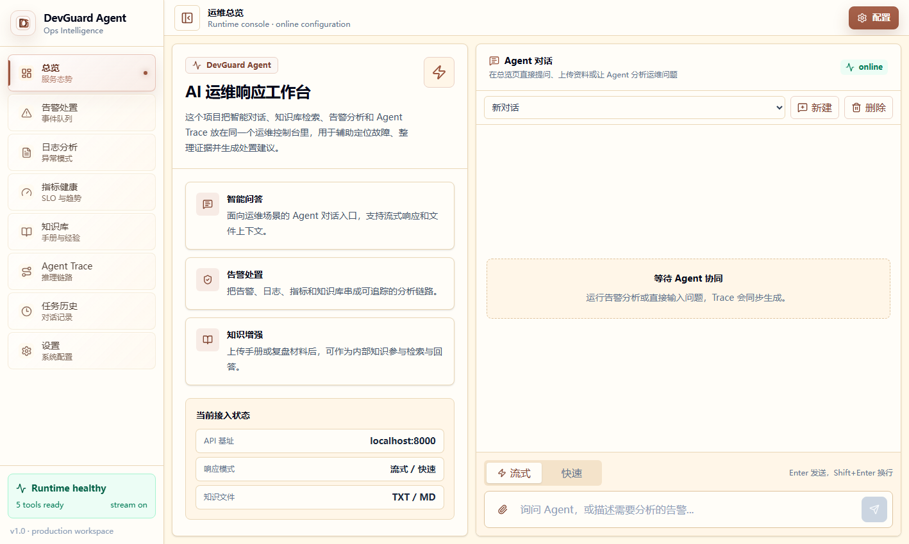
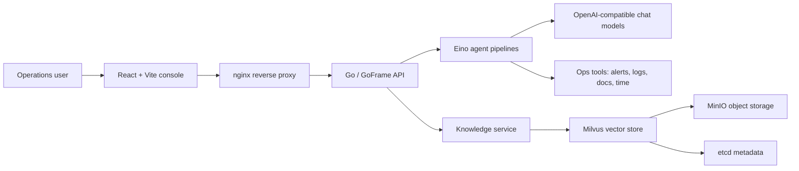

# DevGuard Agent

DevGuard Agent is an AI operations response workspace for incident triage, knowledge-base retrieval, alert analysis, log investigation, and traceable agent execution. It combines a Go backend, a React operations console, and a Milvus-backed knowledge layer so operations teams can move from "what is happening" to "what should I do next" with evidence and repeatable workflows.



## Highlights

- **AI operations console**: unified workspace for chat, alert triage, log analysis, metrics health, knowledge management, task history, and Agent Trace.
- **Streaming and quick responses**: supports both SSE streaming conversations and one-shot diagnostic responses.
- **Knowledge-augmented answers**: uploads Markdown/TXT documents, indexes them into Milvus, and retrieves internal runbooks during analysis.
- **Traceable agent execution**: records planning, tool calls, evidence, risk level, final report, and task lifecycle.
- **Runtime configuration UI**: model, embedding, MCP, Milvus, upload directory, and indexing settings can be managed from the console.
- **Production Docker stack**: backend, frontend nginx, Milvus, MinIO, and etcd are composed for repeatable deployment.

## Architecture



## Tech Stack

| Layer | Technology |
| --- | --- |
| Frontend | React 19, TypeScript, Vite, Tailwind CSS, Zustand, Framer Motion, lucide-react |
| Backend | Go 1.24, GoFrame v2, CloudWeGo Eino, SSE |
| AI / RAG | OpenAI-compatible chat models, embedding model, Milvus retriever/indexer |
| Storage | Milvus standalone, MinIO, etcd, local upload volume |
| Delivery | Docker, Docker Compose, nginx |

## Repository Layout

```text
.
├── api/                         # Go API request/response contracts
├── internal/
│   ├── ai/                      # Agent pipelines, tools, model, retriever, indexer
│   ├── controller/chat/         # Chat, knowledge, config, log, task APIs
│   ├── knowledge/               # Upload, document state, indexing tasks
│   ├── loganalysis/             # Log analysis service
│   ├── taskrecord/              # Agent task persistence
│   └── trace/                   # Agent trace model and runtime state
├── DevGuardAgentFrontend/       # React operations console
├── manifest/
│   ├── config/                  # Runtime configuration templates
│   └── docker/                  # Backend/frontend Dockerfiles and nginx config
├── docs/                        # Runbooks, screenshots, project documentation
├── utility/                     # Common middleware, clients, memory, logging callbacks
├── docker-compose.prod.yml      # Production compose stack
└── main.go                      # Backend entrypoint
```

## Prerequisites

- Go 1.24+
- Node.js 22+ and npm
- Docker Engine with Docker Compose v2
- OpenAI-compatible chat model API key
- OpenAI-compatible embedding model API key

## Local Development

### 1. Configure the backend

Use `manifest/config/config.docker.yaml` as a reference and create a local config file that is not committed:

```bash
cp manifest/config/config.docker.yaml manifest/config/config.yaml
```

Update these values before starting the service:

```yaml
admin:
  config_token: "change-me"
ds_think_chat_model:
  api_key: "<your-chat-api-key>"
  base_url: "https://api.openai.com/v1"
  model: "gpt-5.5"
ds_quick_chat_model:
  api_key: "<your-chat-api-key>"
  base_url: "https://api.openai.com/v1"
  model: "gpt-5.5"
doubao_embedding_model:
  api_key: "<your-embedding-api-key>"
  base_url: "https://api.openai.com/v1"
  model: "text-embedding-3-large"
milvus:
  address: "localhost:19530"
```

### 2. Start backend dependencies

For local development, you can start the production stack dependencies and keep the backend/frontend running from source:

```bash
docker compose -f docker-compose.prod.yml up -d etcd minio standalone
```

### 3. Start the Go API

```bash
go run ./main.go
```

The backend listens on `http://localhost:8000` by default and exposes OpenAPI metadata at:

```text
http://localhost:8000/api.json
```

### 4. Start the frontend

```bash
cd DevGuardAgentFrontend
npm ci
npm run dev
```

The Vite dev server prints the local console URL after startup.

## Production Deployment

The production compose file builds both services and starts the required infrastructure:

```bash
docker compose -f docker-compose.prod.yml up -d --build
```

Recommended environment overrides:

```bash
export HTTP_PORT=80
export DEVGUARD_CONFIG_FILE=./manifest/config/config.docker.yaml
export DEVGUARD_UPLOAD_DIR=/data/devguard/uploads
export DEVGUARD_ETCD_DIR=/data/devguard/etcd
export DEVGUARD_MINIO_DIR=/data/devguard/minio
export DEVGUARD_MILVUS_DIR=/data/devguard/milvus
```

For HTTPS, terminate TLS at nginx or a host-level reverse proxy and forward `/api/*` to the backend while serving the built frontend as static assets.

## Runtime Configuration

DevGuard Agent reads configuration from GoFrame config paths. In Docker, the backend uses:

```text
GF_GCFG_PATH=/app/manifest/config
GF_GCFG_FILE=config.yaml
```

Key configuration sections:

| Section | Purpose |
| --- | --- |
| `server.address` | Backend listen address, default `:8000` |
| `admin.config_token` | Admin token used by protected runtime configuration APIs |
| `ds_think_chat_model` | Model used for deeper reasoning tasks |
| `ds_quick_chat_model` | Model used for quick chat responses |
| `doubao_embedding_model` | Embedding model used for document indexing and retrieval |
| `mcp_url` | Optional MCP endpoint for external tools |
| `milvus.address` | Milvus vector database address |
| `knowledge` | Upload limits, indexing timeout, allowed document extensions |

Keep API keys and production tokens outside Git. Use mounted config files, secret managers, or environment-specific deployment templates.

## API Surface

All business APIs are mounted under `/api`.

| Endpoint | Method | Description |
| --- | --- | --- |
| `/api/chat` | POST | Quick AI response |
| `/api/chat_stream` | GET/POST | Streaming SSE response |
| `/api/ai_ops` | POST | Alert analysis workflow |
| `/api/logs/analyze` | POST | Log investigation summary |
| `/api/upload` | POST | Upload Markdown/TXT documents into the knowledge base |
| `/api/knowledge/documents` | GET/DELETE | List or delete knowledge documents |
| `/api/knowledge/search` | POST | Test knowledge retrieval |
| `/api/knowledge/health` | GET | Check Milvus/collection health |
| `/api/config/runtime` | GET/PUT | Read or update runtime model/tool configuration |
| `/api/tasks` | GET/DELETE | List or delete agent task records |
| `/api/tasks/detail` | GET | Read one agent task and trace detail |

## Knowledge Base Workflow

1. Upload `.md`, `.markdown`, or `.txt` documents from the console.
2. The backend stores the source file and creates an indexing task.
3. The document is chunked, embedded, and written to Milvus.
4. Chat, AIOps, and search flows can retrieve enabled documents as internal evidence.
5. Failed or stale documents can be reindexed, disabled, cleaned up, or deleted.

## Operations Notes

- The backend warns when `admin.config_token` is left as the default value.
- `manifest/config/config.yaml`, `.env`, uploaded files, and local production config are ignored by Git.
- Milvus, MinIO, and etcd data should be persisted on host volumes in production.
- Large frontend chunks may trigger a Vite warning during production builds; this does not block deployment.
- Browser favicons are cached aggressively. After changing `public/favicon.svg`, hard-refresh the page or reopen the tab.

## Testing

Run backend tests:

```bash
go test ./...
```

Run frontend checks:

```bash
cd DevGuardAgentFrontend
npm ci
npm run build
```

## License

This project is released under the MIT License.
